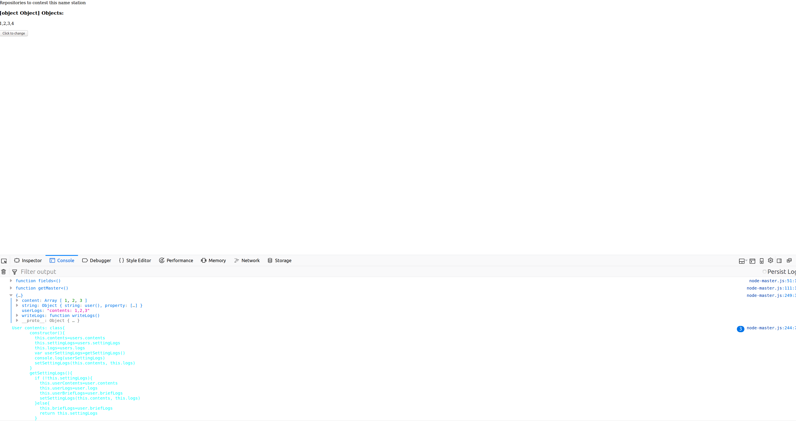

# html_project
A HTML and JavaScript program that runs browser Firefox and Chrome (access to Sadira or other Java programs).

While some features is supported for Firefox and Chrome, but it is not supported for Internet Explorer, because it is just don't meet the browser Internet Explorer, so that is why some features is not supported for Internet Explorer. The **repository** tag is not supported for Internet Explorer (you need to clone this repository to access your **repository** tag by running this command which is this command: `git clone https://github.com/zixuan75/html_project.git`).

If you are a Windows user and you want to use Chrome, please download at the offical website at [here](https://www.google.com/chrome/). If you want to use Firefox on Windows, please download at https://www.mozilla.org/en-US/firefox/new/ for more details. In this program, we do it within like this to setup a local testing server, for example, to fetch those:

```
python -m SimpleHTTPServer 3000
python -m os --fetch-internet -p localhost:3000 "3000"
```
### Screenshots

## Installation
If you are a Linux user and want to use Chrome, please follow the following steps:
#### Debian/Ubuntu:
Follow those steps to install:
###### Chromium:
> sudo apt-get install chromium-browser

###### Chrome:
> sudo apt-get install libxss1 libappindicator1 libindicator7
>
> wget https://dl.google.com/linux/direct/google-chrome-stable_current_amd64.deb
>
> sudo dpkg -i google-chrome*.deb

If you have error messages while you installing with this command, please run this command:

> sudo apt-get install -f

Then you can re-run this command:

> sudo dpkg -i google-chrome*.deb

Or please install forks browser by typing that:

> forks install chrome-browser
> forks get --chrome /usr/bin/chrome

#### Suse/Opensuse:
> wget https://dl.google.com/linux/linux_signing_key.pub
>
> sudo rpm --import linux_signing_key.pub

64 bit:
> sudo zypper ar http://dl.google.com/linux/chrome/rpm/stable/x86_64 google
>
> sudo zypper in google-chrome-stable

32 bit:
> sudo zypper ar http://dl.google.com/linux/chrome/rpm/stable/i386 google
>
> sudo zypper in  google-chrome-stable

#### Fedora/Cent OS/RHEL:
> sudo -i
>
> cat << EOF > /etc/yum.repos.d/google-chrome.repo
[google-chrome]
name=google-chrome - \$basearch
baseurl=http://dl.google.com/linux/chrome/rpm/stable/\$basearch
enabled=1
gpgcheck=1
gpgkey=https://dl-ssl.google.com/linux/linux_signing_key.pub
EOF

##### Fedora 27/26/25/24
> dnf install google-chrome-unstable

##### CentOS/RHEL 7.4
> yum install google-chrome-unstable

*****Note:***** *This is a unstable version of Google Chrome. Please use the Windows installer and configure at https://www.google.com/chrome/ to install the newest stable version or change your end of your command from `google-chrome-unstable` to `google-chrome-stable`.*

If you have problems, please fallback to Xorg with modifying the **/etc/gdm/custom.conf** file on your computer:

> $$ GDM configuration storage
>
> [daemon]
>
> $$ Uncomment the line below to force the login screen to use Xorg
>
> WaylandEnable=false
>
> [security]
> ...

If you are a Linux user and want to use the Firefox browser, please open on the launcher (the browser is automatically installed while you installing your computer), or please type the following command:

> firefox

or:

> bash
>
> firefox
# Usage

Clone this repository:
> git clone https://github.com/zixuan75/html_project.git

Please sure to be use the local testing server to the port 3000 (localhost:3000/), see the guide, [Set up a local testing server](https://developer.mozilla.org/en-US/docs/Learn/Common_questions/set_up_a_local_testing_server) or follow those steps:

#### Python 2
> python -m SimpleHTTPServer 3000
#### Python 3
> python -m http.server 3000

If you don't setup a local testing server, you should add *your file usage* to your computer and follow those steps:
#### Linux/macOS:
Type on your browser's search text area:
> file:///

Just click it to *html_project-master* (inside the `html` folder), then click `node-master.html`.
#### Windows:
See where is your HTML file. -->

Click right on your mouse then just click `Open`.
# Introduction
This is the project page for this repository.

The homepage is normal editing for the component of this description. The homepage is here:
 - [Homepage of this repository](https://github.com/zixuan75/html_project-homepage)

Usually a homepage has a readme file and also don't have a contributing file (because anyone can contribute to the homepage repository), and there is also a homepage of repository on a large repository, for example, [vulhub's homepage](https://github.com/vulhub/vulhub-org). The homepage file not to be has a contributing file if there is no code in their homepage, and if there is a code in their homepage they could have a contributing file and it is usually written in HTML.
## Supplementary Information
The **html_project** (also known as **html-project**) is a program written in HTML and JavaScript, which is able to insert posts to the local testing server collection of your browser, but based on your cloned repository. The Java code is to connect JavaScript within a JavaScript file, also delete some conflicting values for the JavaScript file if they have conflicting values. If you have conflicting values of a JavaScript file within this program and it is not deleted, you may forgot to setup a local testing server. `If there is a conflicting value on your program, you need to cleanup using a JavaScript collection file or make changes and run the Java file on the projects folder. If you don't want it, please open an issue in our project and just commit to change the Java file and create a pull request on this repository. The Java file have commit permissions to the readme conflicting values at the owner's expense, and you did not need to commit to the Java file and force push it for example, you cannot force push to protected branches (such as master).`
